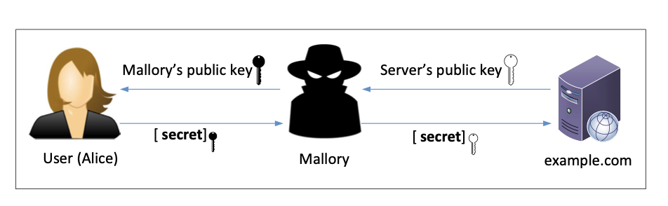

# Public-Key Infrastructure (PKI) Lab

Este laboratório prático visa proporcionar aos estudantes experiência em Infraestrutura de Chave Pública (PKI). Explorando conceitos como criptografia de chave pública, Autoridade de Certificação (CA) e certificados X.509, os alunos compreendem como a PKI opera na segurança da Web, incluindo sua aplicação em serviços como Apache e protocolos HTTP/HTTPS. O foco em ataques de homem-no-meio amplia a compreensão das vulnerabilidades e da importância da confiança na raiz da PKI.Neste documento, utilizamos www.bank32.com como exemplo para mostrar como configurar um servidor Web HTTPS com este nome.

## Setup

No início do processo, procedemos à adição de novas entradas no arquivo de hosts da máquina virtual e iniciamos os containers disponibilizados no laboratório:

```bash
$ docker-compose build  # Build the container image
$ docker-compose up     # Start the container
$ docker-compose down   # Shut down the container

// Aliases for the Compose commands above

$ dcbuild
$ dcup
$ dcdown
```
                 


## Lab Task 1: Becoming a Certificate Authority (CA)

Neste laboratório, focado em Infraestrutura de Chave Pública (PKI), os estudantes têm a oportunidade de criar e gerenciar certificados digitais usando o OpenSSL. Ao se tornarem uma Autoridade de Certificação (CA) raiz, os participantes aprendem a emitir certificados digitais autoassinados e explorar a configuração necessária para estabelecer a PKI. O uso do arquivo de configuração openssl.conf é destacado, assim como a geração de certificados e chaves privadas. O objetivo é capacitar os alunos a compreender como a PKI opera, especialmente no contexto de certificados autoassinados e sua importância na construção de confiança na infraestrutura de chaves públicas.

No comando seguinte, utilizamos -subj para definir a informação do assunto e utilizamos -passout pass:deestoset os códigos de palavra-passe.

```bash
openssl req -x509 -newkey rsa:4096 -sha256 -days 3650 \
            -keyout ca.key -out ca.crt  \
            -subj "/CN=www.modelCA.com/O=Model CA LTD./C=US" \
            -passout pass:dees
```

Podemos utilizar os seguintes comandos para ver o conteúdo descodificado do certificado X509 e da chave RSA (-text significa descodificar o conteúdo para texto simples; -noout significa não imprimir a versão codificada):

```bash
openssl x509 -in ca.crt -text -noout
openssl rsa  -in ca.key -text -noout
```

## Lab Task 2: Generating a Certificate Request for Your Web Server

Neste laboratório, foi simulada a criação de uma Autoridade de Certificação (CA) própria, que emite certificados digitais sem depender de CAs comerciais. O foco foi entender a geração de Certificados de Solicitação de Assinatura (CSR) para entidades, como servidores. A CA, confiável por ser autoassinada, foi configurada com um arquivo de especificação openssl.conf, indicando os diretórios de armazenamento e outras configurações. Em seguida, um CSR para um servidor fictício (www.bank32.com) foi gerado, incluindo informações de identidade. Foi destacada a importância de adicionar Nomes Alternativos ao CSR para lidar com múltiplos domínios associados ao mesmo servidor. O laboratório visa proporcionar uma compreensão prática do funcionamento da Infraestrutura de Chave Pública (PKI) e como ela é aplicada na segurança web.

```bash

10.9.0.80   www.bank32.com
10.9.0.80   www.smith2020.com

```

Podemos utilizar o seguinte comando para ver o conteúdo descodificado dos ficheiros CSR e de chave privada:

```bash
openssl req -in server.csr -text -noout
openssl rsa -in server.key -text -noout
```

## Lab Task 3: Generating a Certificate for your server

Nesta etapa, o ficheiro CSR (Certificate Signing Request) precisa ser assinado pela Autoridade de Certificação (CA) para formar um certificado. Geralmente, os ficheiros CSR são enviados a uma CA confiável para obter essa assinatura, mas neste laboratório, utilizamos nossa própria CA confiável para gerar certificados. O comando 'openssl ca' é empregado para converter o pedido de assinatura de certificado ('server.csr') em um certificado X509 ('server.crt'). Durante esse processo, são utilizados os ficheiros 'ca.crt' e 'ca.key' da CA, e a configuração é regida pelo ficheiro 'myCA_openssl.cnf'. Após a assinatura, verifica-se o conteúdo decodificado do certificado com o comando 'openssl x509'. É importante mencionar que, por questões de segurança, é necessário habilitar a cópia das extensões do pedido para o certificado final no ficheiro de configuração da CA.


O comando a seguir transforma a solicitação de assinatura de certificado (server.csr) em um certificado X509 (server.crt), usando os arquivos ca.crt e ca.key da CA:

```bash
openssl ca -config myCA_openssl.cnf -policy policy_anything \
           -md sha256 -days 3650 \
           -in server.csr -out server.crt -batch \
           -cert ca.crt -keyfile ca.key
```

No comando acima, myCA openssl.cnf é o ficheiro de configuração que copiámos de /usr/lib/ ssl/openssl.cnf (também fizemos alterações a este ficheiro na Tarefa 1). Usamos a política anything policy definida no arquivo de configuração.


## Lab Task 4: Deploying Certificate in an Apache-Based HTTPS Website

Nesta tarefa, focamo-nos na implementação e configuração de um servidor HTTPS utilizando o Apache, destacando o papel crucial dos certificados de chave pública na segurança da comunicação online. Utilizamos o exemplo fictício do site bank32.com para demonstrar como criar uma configuração de VirtualHost que suporta HTTPS. Ao ativar o módulo SSL no Apache e iniciar o servidor, enfrentamos desafios comuns, incentivando os alunos a diagnosticar e corrigir problemas. A tarefa culmina na navegação bem-sucedida no site HTTPS, evidenciando a importância da confiança nos certificados e destacando a capacidade de gerir certificados no navegador Firefox. Este exercício prático proporciona uma compreensão prática dos conceitos de infraestrutura de chave pública e fortalece as habilidades dos alunos na implementação de ambientes seguros na web.


Para que o site funcione, precisamos habilitar o módulo ssl do Apache e, em seguida, habilitar este site. Isso pode ser feito usando os seguintes comandos, que já são executados quando o container é construído.


```bash
# a2enmod ssl                 // Enable the SSL module
# a2ensite bank32_apache_ssl  // Enable the sites described in this file
```

Iniciar o servidor Apache. O servidor Apache não é iniciado automaticamente no contentor, devido à necessidade de introduzir a palavra-passe para desbloquear a chave privada.

```bash
// Start the server   # service apache2 start
// Stop the server    # service apache2 stop
// Restart a server   # service apache2 restart
```

## Lab Task 5: Launching a Man-In-The-Middle Attack

Na tarefa em questão, foi desenvolvida uma simulação para ilustrar como a Infraestrutura de Chave Pública (PKI) desempenha um papel crucial na prevenção de ataques Man-In-The-Middle (MITM). O cenário envolveu a criação de um site malicioso para se passar por um site legítimo (www.example.com), utilizando o mesmo servidor Apache configurado previamente. Em seguida, foi emulado um ataque DNS, onde o arquivo /etc/hosts da máquina da vítima foi modificado para redirecionar o tráfego para o servidor malicioso. Essa abordagem simulada destacou como um atacante, ao comprometer a Infraestrutura de Chave Pública, poderia interceptar comunicações seguras, revelando informações sensíveis trocadas entre usuários e servidores. O experimento sublinha a importância da PKI na autenticação do servidor para prevenir eficazmente esse tipo de ameaça MITM.




## Lab Task 6: Launching a Man-In-The-Middle Attack with a Compromised CA

Nesta tarefa, assume-se que a Autoridade de Certificação (CA) raiz foi comprometida, possibilitando que um atacante utilize sua chave privada para gerar certificados fraudulentos. O experimento tem como objetivo demonstrar as implicações desse comprometimento, evidenciando que o atacante pode executar com sucesso ataques do tipo "Man-in-the-Middle" (MITM) em sites HTTPS. Ao utilizar a configuração previamente estabelecida, a demonstração visa mostrar que o navegador não suspeitará quando a vítima tentar acessar um site legítimo, direcionando-a, na verdade, para um site falso controlado pelo atacante. Esse cenário destaca a severidade das consequências quando a confiança na integridade de uma CA raiz é comprometida, permitindo manipulação da confiança nos certificados digitais e facilitando ataques de interceptação em comunicações seguras na web. O navegador não levantará qualquer suspeita quando a vítima tentar visitar um sítio Web, mas for parar ao sítio falso do atacante MITM.


