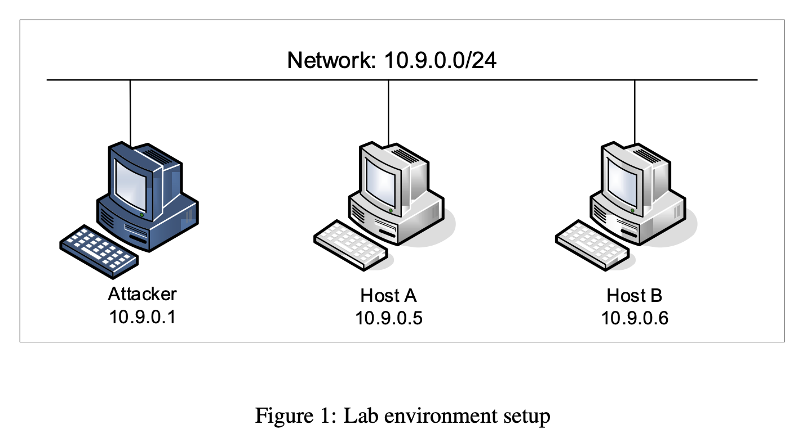

# Packet Sniffing and Spoofing Lab

O objetivo do trabalho esta semana é perceber mecanismos para monitorização e manipulação de tráfego. 

O sniffing e o spoofing de pacotes são dois conceitos importantes na segurança de redes; são duas grandes ameaças na comunicação em rede. Ser capaz de compreender estas duas ameaças é essencial para compreender as medidas de segurança nas redes. Existem muitas ferramentas de sniffing e spoofing de pacotes, como o Wireshark, o Tcpdump, o Netwox, o Scapy, etc. Algumas dessas ferramentas são amplamente utilizadas por especialistas em segurança, bem como por atacantes.

## 2. Environment Setup using Container

Neste laboratório, usaremos três máquinas conectadas à mesma LAN. Podemos usar três VMs ou três contêineres. A Figura 1 mostra a configuração do ambiente de laboratório usando contêineres. Realizaremos todos os ataques no contentor do atacante, utilizando os outros contentores como máquinas de utilizador.




### 2.1 Container Setup and Commands

A seguir, listamos alguns dos comandos comumente usados relacionados ao Docker e ao Compose. Como vamos usar esses comandos com muita frequência, criamos aliases para eles no arquivo .bashrc

```bash
$ docker-compose build  # Build the container image
$ docker-compose up     # Start the container
$ docker-compose down   # Shut down the container

// Aliases for the Compose commands above
$ dcbuild               # Alias for: docker-compose build
$ dcup                  # Alias for: docker-compose up
$ dcdown                # Alias for: docker-compose down
```

### 2.2 About the Attacker Container

Quando usamos o contentor do atacante para lançar ataques, precisamos de colocar o código de ataque dentro do contentor do atacante. A edição de código é mais conveniente dentro da VM do que em contêineres, porque podemos usar nossos editores favoritos. Para que a VM e o contêiner compartilhem arquivos, criamos uma pasta compartilhada entre a VM e o contêiner usando os volumes do Docker.

## Lab Task 1.1: Sniffing Packets

O Wireshark é a ferramenta de sniffing mais popular e é fácil de usar. Vamos usá-lo durante todo o laboratório. No entanto, é difícil usar o Wireshark como um bloco de construção para construir outras ferramentas. Usaremos o Scapy para esse fim. O objetivo desta tarefa é aprender como usar o Scapy para fazer packet sniffing em programas Python.

```bash
#!/usr/bin/env python3
from scapy.all import *
def print_pkt(pkt):
  pkt.show()
pkt = sniff(iface=’br-c93733e9f913’, filter=’icmp’, prn=print_pkt)
```
O código acima irá detetar os pacotes na interface br-c93733e9f913.

## Lab Task 1.2: Spoofing ICMP Packets

Neste contexto, o Scapy é utilizado como uma ferramenta flexível para manipulação de pacotes, permitindo a criação e envio de pacotes ICMP echo request com endereços IP de origem escolhidos pelos participantes. O código fornecido serve como um guia, mostrando como construir e enviar esses pacotes falsificados. A ação proposta consiste em enviar os pacotes para outra VM na mesma rede e observar se a resposta de eco é direcionada ao endereço IP falsificado. Essa tarefa destaca a importância do entendimento prático de como os pacotes de rede são construídos e manipulados, fornecendo aos participantes uma experiência prática na simulação de falsificação de pacotes e na observação dos resultados por meio do Wireshark.

## Lab Task 1.3: Traceroute

Para realizar esta tarefa, é preciso utilizar o Scapy para construir e enviar pacotes ICMP para um destino selecionado, incrementando gradualmente o campo Time-To-Live (TTL). O procedimento envolve a criação de um objeto IP e ICMP no Scapy, onde será necessário definir o endereço de destino no objeto IP e inicializar o campo TTL. O pacote deve ser então enviado, e a resposta ICMP fornecerá informações sobre o primeiro roteador alcançado. Repetindo esse processo com um incremento progressivo no TTL, será possível identificar os roteadores intermediários até que o pacote alcance o destino final.

Os participantes têm a opção de automatizar esse procedimento, escrevendo um script Python que manipula o aumento do TTL em cada rodada e registra os endereços IP obtidos. Para aqueles menos familiarizados com a programação Python, é possível realizar o procedimento manualmente, alterando o campo TTL a cada iteração e observando os resultados no Wireshark. O objetivo é obter uma estimativa da distância em termos de número de roteadores até o destino, sem a necessidade de seguir um caminho exato, já que diferentes pacotes podem seguir rotas distintas em um curto período.

## Lab Task 1.4: Sniffing and-then Spoofing

Nesta tarefa, é necessário combinar as técnicas de sniffing e spoofing para implementar o programa "sniff-and-then-spoof". Utilizando as ferramentas Scapy, a VM e o contentor do utilizador na mesma LAN, o programa ping é iniciado no contentor do utilizador para gerar um pacote de pedido de eco ICMP destinado a um IP X específico. Se X estiver ativo, o programa ping receberá uma resposta de eco e imprimirá essa resposta. Simultaneamente, o programa "sniff-and-then-spoof" na VM, ao monitorar a LAN através do sniffing de pacotes, identifica qualquer pedido de eco ICMP e responde imediatamente, independentemente do endereço IP de destino, utilizando a técnica de falsificação de pacotes com o Scapy. Isso garante que o programa ping, independentemente do estado de X, sempre receba uma resposta, indicando que X está vivo. O relatório deve incluir evidências que demonstrem a eficácia da técnica, e também é necessário realizar pings para três endereços IP específicos a partir do contentor do utilizador, relatando as observações e explicando os resultados com base no protocolo ARP e no roteamento. O comando "ip route get 1.2.3.4" pode ser utilizado para identificar o roteador associado a um destino específico.


