# Lab Semana 3

Neste lab, deparamo-nos com uma storefront de WordPress para planos de website hosting.


Como o primeiro passo é reconhecimento, procurámos a página web por informações pertinentes que nos pudessem ajudar a encontrar vulnerabilidades.

Ao clicar num dos comentários na aba direita, somos redirecionados á página de um produto.

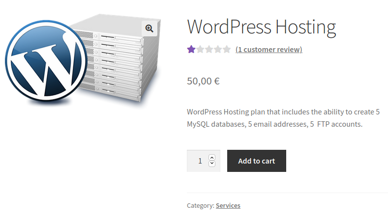

Ao ler os comentários, é aparente que existe algum tipo de vulnerabilidade associada ao mesmo.

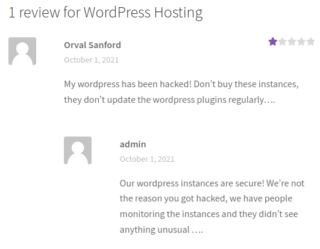

Investigando melhor, vemos que na aba `Additional Information` à esquerda são listadas as versões de WordPress e plugins utilizados relevantes ao serviço. Este tipo de informações não deveria estar disponível ao público. 

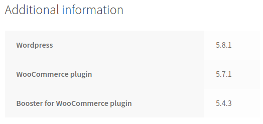

Também reparamos que existe outra vulnerabilidade: é possível verificar as contas que existem, ao tentar fazer reset à password. Trata-se, mais uma vez, de informação priveligiada, que não deveria ser pública.

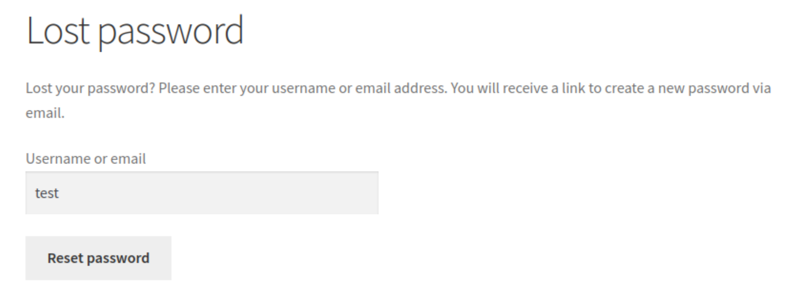

Aqui testamos um username aleatório para verificar se existe. Verificamos que não existe uma vez que não é permitido recuperar a password. 


Tentaremos agora sob o some de "admin", para verificar se existe.

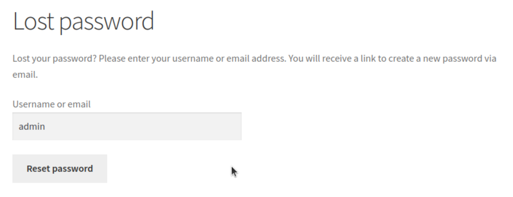

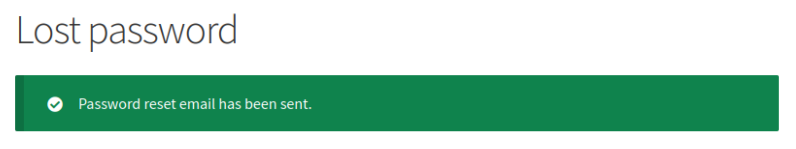

Chegamos assim à conclusão que existe sim, uma conta com o username "admin". 

Munidos destas informações, fomos em busca de vulnerabilidades que pudessem existir num destes plugins que nos permitissem ganhar acesso à conta `admin`.

Após ler sobre várias vulnerabilidades, encontrámos o [CVE-2021-34646](https://www.cvedetails.com/cve/CVE-2021-34646/), descrito do seguinte modo:

> Versions up to, and including, 5.4.3, of the Booster for WooCommerce WordPress plugin are vulnerable to authentication bypass via the process_email_verification function due to a random token generation weakness in the reset_and_mail_activation_link function found in the ~/includes/class-wcj-emails-verification.php file. This allows attackers to impersonate users and trigger an email address verification for arbitrary accounts, including administrative accounts, and automatically be logged in as that user, including any site administrators. This requires the Email Verification module to be active in the plugin and the Login User After Successful Verification setting to be enabled, which it is by default.

Seguidamente, sendo a versão do plugin `Booster for WooCommerce` utilizado exatamente a mesma da versão listada do CVE, pareceu-nos o melhor candidato para este CTF, e, de tal modo, submetendo a flag `flag{CVE-2021-34646}` conseguimos completar o desafio 1.

Logo a seguir fomos à procura de um exemplo concreto ou ou proof of concept da vulnerabilidade.

Tal como sugerido, utilizámos a Exploit Database para a procura, tendo encontrado [este exemplo](https://www.exploit-db.com/exploits/50299).

De seguida, seguimos as instruções comentadas acima do código:

```py
# 1:
# Goto: https://target.com/wp-json/wp/v2/users/
# Pick a user-ID (e.g. 1 - usualy is the admin)
#
# 2:
# Attack with: ./exploit_CVE-2021-34646.py https://target.com/ 1
#
# 3:
# Check-Out  out which of the generated links allows you to access the system```
```

Substituindo o domínio para o passo 1, seguimos para http://ctf-fsi.fe.up.pt:5001/wp-json/wp/v2/users/<nolink>:

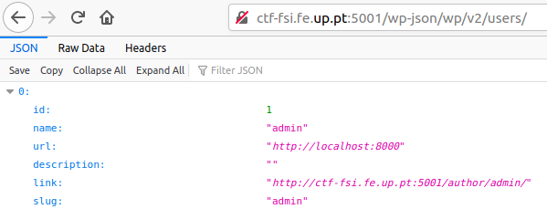

Com o id do utilizador `admin` obtido, corremos o exploit:

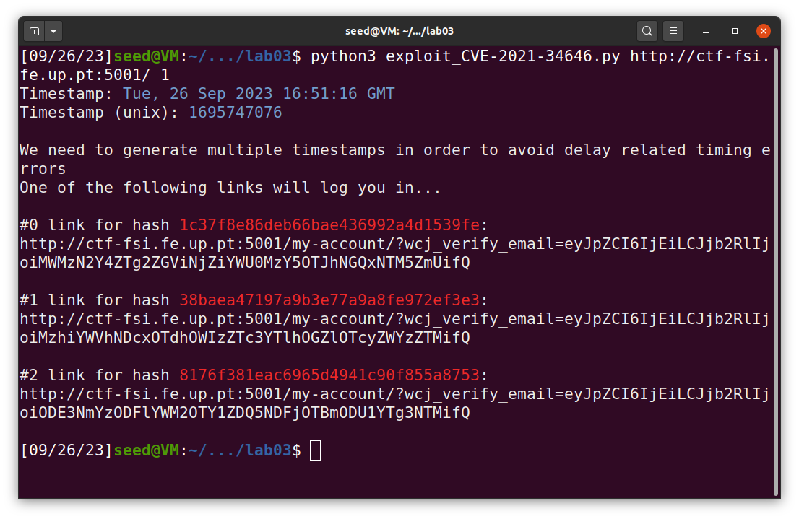

E ao clicar no primeiro endereço:

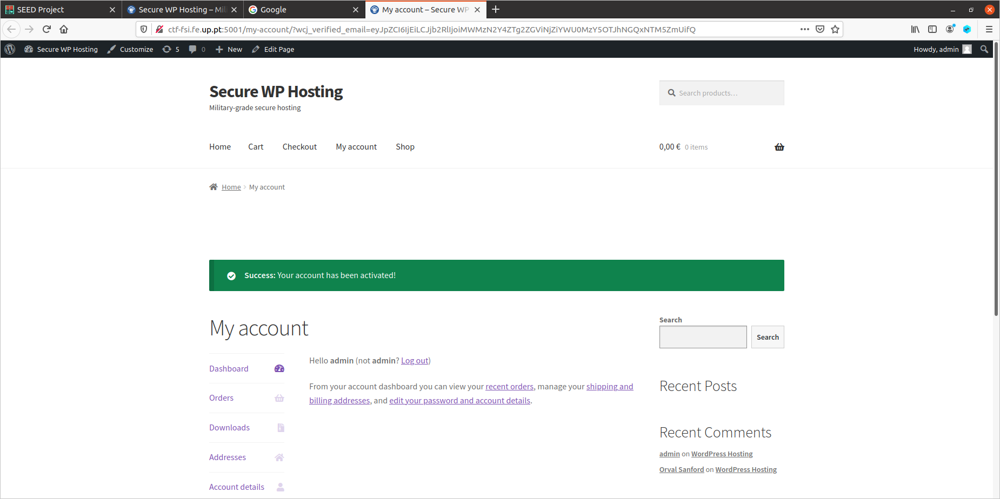

Ganhamos assim acesso à conta `admin`. Seguindo as instruções do guião, dirigimo-nos a http://ctf-fsi.fe.up.pt:5001/wp-admin/edit.php.

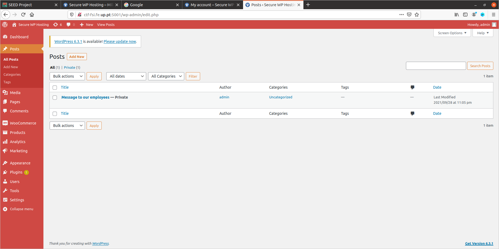

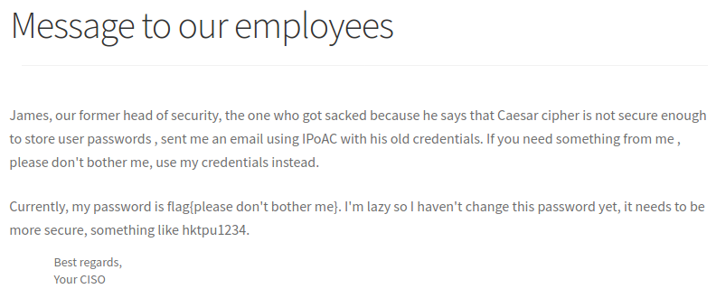

> `flag{please don't bother me}`

Conseguimos, assim, obter a flag e completar o desafio 2 e o CTF em si.