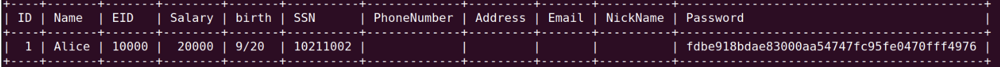

Neste Lab, foi criada uma aplicação Web deliberadamente vulnerável para simular os riscos de injeção de SQL. O objetivo é identificar e explorar estas vulnerabilidades, demonstrando os potenciais danos e dominando as técnicas de defesa. O laboratório aborda tópicos como instruções SQL (SELECT e UPDATE), injeção de SQL e utilização de instruções preparadas.
Este laboratório destaca a importância de fortalecer a segurança contra esse tipo comum de ataque em desenvolvimentos web.

## Setup

Começamos com a adição de uma nova entrada no arquivo de hosts da máquina virtual. Esse passo é importante para assegurar a correta comunicação com os recursos necessários. De seguida, iniciamos os containers que foram disponibilizados para o laboratório, configurando assim o ambiente necessário para os exercícios. Finalmente, acedemos a uma shell que nos permite interagir diretamente com a base de dados em uso, facilitando a realização dos exercícios propostos e permitindo uma manipulação efetiva dos dados.

## Lab Task 1: SQL Statements (get familiar)

Para obter as informações do usuário "Alice" de uma base de dados, utilizamos uma instrução que consulta a tabela de usuários. Essa instrução filtra especificamente pelo nome de usuário "Alice", extraindo todos os dados relacionados a este usuário, usando o seguinte comando:

```bash
SELECT * FROM credentials WHERE Name = "Alice";
```

Obtemos assim todos os dados deste usuário em específico:



## Lab Task 2: SQL Injection Attack on SELECT Statement

### Task 2.1 - Login in adminstrator mode from webpage

A Injeção SQL é uma técnica explorada por atacantes para inserir comandos SQL maliciosos, potencialmente extraindo ou alterando dados em aplicações web. A nossa aplicação de gerenciamento de funcionários apresenta vulnerabilidades de injeção SQL, simbolizando erros comuns de desenvolvedores.

Nesta tarefa, focamo-nos na página de login do www.seed-server.com. O objetivo é realizar o login na aplicação sem conhecimento das credenciais dos funcionários. O processo de autenticação, baseado em código PHP, envolve a obtenção de inputs do usuário, hash das senhas e execução de consultas SQL para autenticação.

Compreender esse fluxo é essencial para explorar as vulnerabilidades de injeção SQL e obter acesso não autorizado à aplicação. 


O código abaixo mostra como é feito o processo de autenticação na aplicação:

```bash
$input_uname = $_GET[’username’];
$input_pwd = $_GET[’Password’];
$hashed_pwd = sha1($input_pwd);
...
$sql = "SELECT id, name, eid, salary, birth, ssn, address, email,
               nickname, Password
        FROM credential
        WHERE name= ’$input_uname’ and Password=’$hashed_pwd’";
$result = $conn -> query($sql);

// The following is Pseudo Code
if(id != NULL) {
  if(name==’admin’) {
     return All employees information;
  } else if (name !=NULL){
    return employee information;
  }
} else {
  Authentication Fails;
}
```

Começamos por explorar o website "www.seed-server.com", que está a ser executado num contentor Docker, e ao examinar o ficheiro "unsafe_home.php", detetámos que o método utilizado para construir as consultas SQL neste site é susceptível a vulnerabilidades. A questão central é a forma como o servidor elabora as consultas SQL, integrando diretamente os dados inseridos pelo utilizador, sem uma adequada sanitização. Este procedimento torna o sistema vulnerável a ataques de injeção SQL, nos quais entradas maliciosas podem alterar ou comprometer a segurança e integridade da base de dados:

```bash
WHERE name= '$input_uname' and Password='$hashed_pwd'
```

Ao focar exclusivamente no campo do nome de utilizador, podemos explorar a vulnerabilidade do sistema, especialmente tendo em conta que o campo da palavra-passe é cifrado. Ao inserirmos o input "admin'#", conseguimos obter acesso privilegiado. Este input efetivamente comenta a parte da consulta SQL que verifica a palavra-passe, tornando-a irrelevante. Deste modo, o código que o servidor executa altera-se, passando a ignorar a verificação da palavra-passe e concedendo acesso baseado apenas no nome de utilizador fornecido.

Depois de fazer login, conseguimos obter todos os dados com as infomações dos usuários. 


### Task 2.2: SQL Injection Attack from command line.

Neste caso, o objetivo é alcançar o mesmo resultado da tarefa anterior, mas sem utilizar a interface da página web. Para tal, podemos fazer um pedido HTTP GET diretamente à aplicação web, enviando os parâmetros de nome de utilizador e palavra-passe. Isto pode ser feito através da execução de um comando na shell, como por exemplo: 

```bash
$ curl 'www.seed-server.com/unsafe_home.php?username=alice&Password=11'
```

Este método permite interagir com o servidor de forma programática, enviando os dados necessários para autenticação diretamente através da linha de comandos.

Utilizando o mesmo input da secção anterior, mas cifrando-o de acordo com as convenções de codificação URL (%27 para representar a aspa simples ' e %23 para o símbolo #), obtemos um comando com intenções maliciosas. Este comando aproveita a vulnerabilidade da aplicação ao injetar código SQL através dos parâmetros da URL. A cifração dos caracteres especiais permite que o input malicioso seja transmitido de forma segura através do protocolo HTTP, sem ser bloqueado ou alterado pelo navegador ou outros intermediários da rede.

```bash
curl "http://www.seed-server.com/unsafe_home.php?username=admin%27%23&Password="
```

Ao executar o procedimento descrito, conseguimos efetivamente aceder à página HTML destinada ao administrador, conforme era o nosso objetivo. Nesta página, tivemos a oportunidade de visualizar as informações dos funcionários, que estavam claramente exibidas no código resultante da execução do comando. Este acesso permitiu-nos analisar detalhes relevantes dos empregados, que estavam originalmente restritos apenas a utilizadores com privilégios administrativos.


### Task 2.3: Append a new SQL statement

O propósito desta tarefa é alterar a base de dados da aplicação web, explorando a mesma vulnerabilidade identificada anteriormente na página de login. O objetivo é realizar duas operações SQL, sendo uma delas um comando de atualização (update) ou eliminação (delete). Se a função multi-query do MySQL estivesse em uso, seria possível realizar a injeção de várias consultas simultaneamente.

Para realizar um ataque que cause um efeito secundário no servidor, como por exemplo eliminar uma tabela, é possível modificar o input inicial para incluir novos comandos SQL, utilizando o caractere ";". Este método permite encadear várias instruções SQL numa única linha de comando. Por exemplo, depois do input inicial, poderíamos adicionar um comando para eliminar a tabela de credenciais, o que causaria um impacto significativo na integridade dos dados da aplicação web. Este tipo de ataque explora a mesma vulnerabilidade, mas com um objetivo mais destrutivo.

```bash
admin'; DROP TABLE IF EXISTS credentials; #
```
Contudo, o ataque não permite a execução de duas instruções SQL simultâneas devido à utilização da função mysql query, que impede a injeção de múltiplas consultas numa única instrução.


## Lab Task 3: SQL Injection Attack on UPDATE Statement

Nesta situação, a página de edição das informações pessoais dos funcionários está disponível após um login bem-sucedido na aplicação web. Isto significa que, para aceder a esta página e efetuar mudanças nos detalhes dos funcionários, é necessário autenticar-se primeiro com credenciais válidas. Uma vez autenticado, o utilizador terá permissão para visualizar e alterar os dados pessoais dos empregados, assumindo que tem os privilégios necessários para tal. Esta funcionalidade é comum em sistemas de gestão de recursos humanos ou em intranets empresariais, permitindo a atualização de informações importantes como contactos, qualificações, e outros dados relevantes dos funcionários.


### Task 3.1: Modify your own salary

Após efetuar login com uma conta válida no sistema (por exemplo, utilizando o nome de utilizador 'Alice' e a palavra-passe '11'), obtivemos acesso a uma página que permite editar os dados pessoais dos funcionários. Esta página é gerida pelo ficheiro "unsafe_edit_backend.php", que cria dinamicamente a instrução SQL para atualizar os dados, usando as strings fornecidas pelo utilizador sem sanitização.


Os funcionários têm permissão para alterar apenas alguns campos específicos, como o "Nickname", "Email", "Address", "Phone Number" e "Password". No entanto, descobrimos uma forma de manipular outros campos, como o "Salary", que não é suposto ser editável nesta interface. Ao inserir a string "Alice', Salary='50000' WHERE EID='10000' #" no campo "Nickname", conseguimos alterar o salário da Alice para 50.000, além de atualizar o nickname. Este método explora a mesma vulnerabilidade de injeção SQL, permitindo modificar dados que, em condições normais, estariam fora do alcance do utilizador.


### Task 3.2: Modify other people' salary

Após aumentar seu salário, Alice decide punir seu chefe, reduzindo o salário de Boby para 1 dólar.

Para modificar o valor do salário de outro utilizador, recorremos a uma abordagem semelhante à utilizada anteriormente, mas com uma alteração crucial na cláusula WHERE. Essencialmente, formulamos uma nova cláusula WHERE para especificar o utilizador cujo salário queremos alterar, e utilizamos um comentário (#) para neutralizar a cláusula WHERE original que está presente no sistema. Desta forma, o comando SQL injetado ignora a condição de pesquisa padrão do sistema e aplica a nossa cláusula personalizada. Isto permite-nos direcionar especificamente o utilizador desejado e modificar o seu salário, sem afetar outros utilizadores ou ser restritos pelas condições de pesquisa originais da aplicação.

```bash
Salary='-9999999' WHERE Name='Boby'#
```


### Task 3.3: Modify other people' password

Insatisfeita mesmo após ações anteriores, Alice altera a senha de Boby para uma conhecida por ela, visando acessar sua conta e causar mais danos.

Para efetuar a alteração, utilizamos uma abordagem semelhante à das tarefas anteriores, injetando um comando SQL. No entanto, antes de proceder com a injeção, ciframos a nova palavra-passe com criptografia SHA1. Por exemplo, se quisermos definir a nova palavra-passe como "flamingo", primeiro obtemos o seu valor hash SHA1, que pode ser algo como "e2e0f310e84f499b07af3da3391a6fdae5b6c2a2". O input malicioso seria então algo como 'password='e2e0f310e84f499b07af3da3391a6fdae5b6c2a2' WHERE name='Boby'#.

Este método permite-nos atualizar a palavra-passe do Boby na base de dados, e posteriormente, podemos fazer login na conta dele utilizando a nova palavra-passe "flamingo".

Foi assim executado o seguinte código:

```bash
UPDATE credential SET
nickname='$input_nickname',
email='$input_email',
address='$input_address',
Password='$hashed_pwd',
password='e2e0f310e84f499b07af3da3391a6fdae5b6c2a2' WHERE name='Boby'# WHERE ID=$id;
```

# CTF

Neste CTF, tivemos de entrar num sistema, a partir de um login, com SQL Injection.

Optamos por inserir o seguinte código SQL no campo de início de sessão do nome de utilizador: admin'--. Ao enviar essa sequência para o servidor, o código SQL injetado substituirá $username na consulta, alterando a estrutura para query="SELECTusernameFROMuserWHEREusername=′".username."′ANDpassword=′".password."′";query = "SELECT username FROM user WHERE username = '".username."' AND password = '".password."'";query="SELECTusernameFROMuserWHEREusername=′".username."′ANDpassword=′".password."′";. O caractere de apóstrofo que inserimos após "admin" encerrará a cadeia de pesquisa, fazendo com que os caracteres "--" sejam interpretados como código SQL. Em SQL, "--" é a sintaxe para comentar uma linha, assim, a consulta comentará tudo após 'admin', efetivamente transformando a consulta para $query = "SELECT username FROM user WHERE username = 'admin'";. Agora, a consulta procura apenas na base de dados usando um nome de utilizador, possibilitando o acesso a uma conta apenas com o conhecimento do nome de utilizador, tornando a palavra-passe irrelevante.


